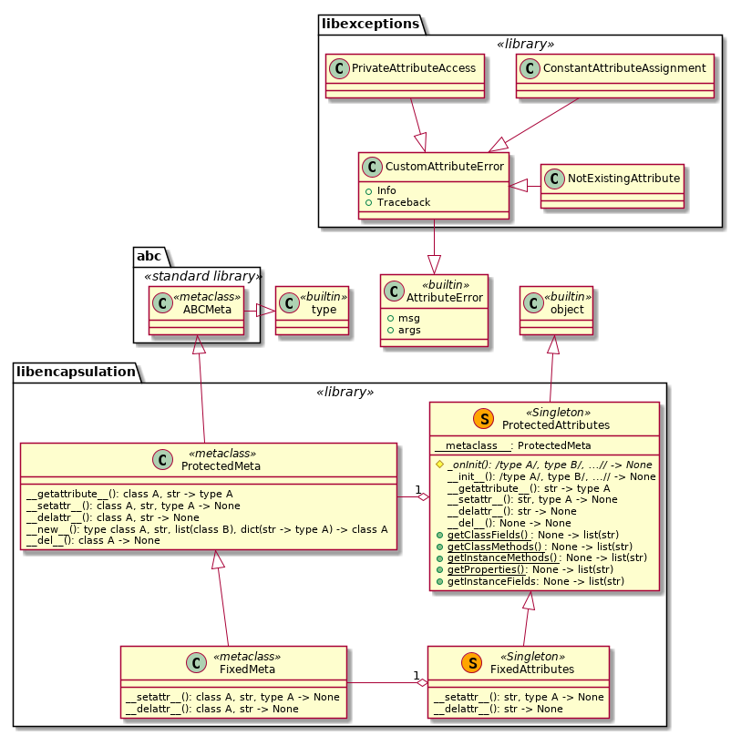

# Library libencapsulation

## Scope and Implemented Functionality

Implements 'protected' attributes of classes and class instance objects, which are not 'visible' to a class\` client. Such attributes are not accessible either using dot notation or the standard *getattr*() and *setattr*() functions, therefore they are considered to be a 'private property' of a class, which are intended for the internal implemenation of the class\` mechanics and not as a part of the public API of the class. Unlike the real private attributes in the C++ sense, these attributes are inherited by the sub-classes of such class. Therefore 'protected attributes' is a more suitable name.

Note that such 'protected' attributes can still be accessed via class / instance dictionary ('magic' attribute **\_\_dict\_\_**) or using the 'original' attribute resolution 'magic' methods *\_\_getattribute\_\_*() and *\_\_setattr\_\_*() of the **type** and **object** classes respectively.

Second, the class attributes referencing any method (class, static or instance) cannot be re-assigned or deleted from a class without instantiation or from its instance. The class attributes referencing the properties cannot be re-assigned or deleted from a class without instantiation, and from the class instance they can be assinged to or deleted only if the property has the corresponding descriptors.

Third, the class data attributes (not methods or properties) are the C++ like static fields. Assignment to such an attribute from a (sub-) class or an instance of a (sub-) class changes the value of the attribute in the class, where it is defined, instead of creating a new attribute local to the object. Thus, the change is visible to all sub-classes of the class, where the attribute is defined, and to their already created instances.

Fourth, two strategies concerning the assignment to a non-existing attribute:

* preserving the standard Python convention, i.e. creating a new attribute local to the object
* raising an exception as a denial of creation of a new attribute 'on the fly'

Within the second strategy it is also not possible to delete any existing attribute during the lifetime of the object, whereas the first strategy allows deletion of the existing instance attributes and the class data attributes (not methods or properties) local to the class

Finally, if an instance attribute or class data attribute has *descriptors* (\_\_get\_\_(), \_\_set\_\_(), \_\_delete\_\_()) the read access, modification or deletion of such an attribure calls the corresponding descriptor.

## Implemented Classes

Two classes are available to the clients of the library:

* ProtectedAttributes
* FixedAttributes

The class *ProtectedAttributes* introduces the following modifications to the data model:

* C++ like static fields based on the class attributes
* Protected class and instance attributes
* Support of the descriptors on the class and instance level
* Class, static and instance methods and properties cannot be deleted or assigned to from a class object without instantiation
* Class, static and instance methods cannot be deleted or assigned to from an instance of a class
* Properties can be assigned to from an instance of a class if the property has \_\_set\_\_ descriptor
* Properties can be deleted from an instance of a class if the property has \_\_delete\_\_ descriptor

The class *FixedAttributes* also adds the contant data structure of an object during its lifetime, i.e.:

* Neither class nor instance data attributes can be deleted or created during the lifetime of the object

Both classes implement singleton behaviour, i.e. their sub-classes cannot be instantiated unless they re-define the protected method \_onInit() without the **@abc.abstract** decorator. This method is the only place inside the class' definition, where the protected instance attributes can be defined using the dot notation. It is supposed that all instance attributes are to be created inside this \_onInit() method. Do not modify the initialization magic method \_\_init\_\_()!



## Content of the Library

All functionality of the library is implemented within a single Python module **classes**, and all other files within the library are for testing and documentation, see the diaram below. The only two classes intended for the use by the library's clients: *ProtectedAttributes* and *FixedAttributes* - are aliased at the library's top interface level. Thus, these classes can be imported simply as:

```python
from libencapsulation import ProtectedAttributes
```

or by using any other allowed patterns, e.g.

```python
import libencapsulation as libenc

BaseClass = libenc.FixedAttributes

class MyClass(BaseClass):
    ....
```

The custom exceptions: *CustomAttributeError*, *NotExistingAttribute*, *PrivateAttributeAccess* and *ConstantAttributeAssignment* - raised by these classes and defined in the **libexceptions** library are also aliased at the **libencapsulation** library's top interface level. Therefore, they can be imported directly from the **libencapsulation** library as well as from the **libexceptions** library.


