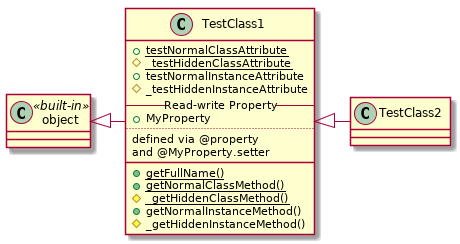
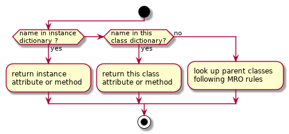
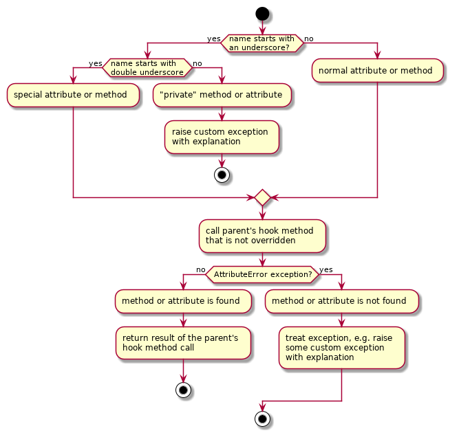
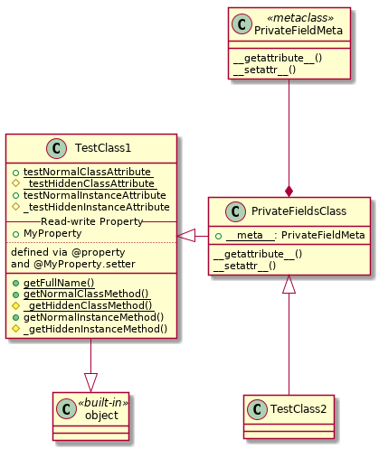

# PA002 Problem Analysis on the Class and Instance Attributes Resolution

## Introduction

The properties provide an elegant way to interface the supposedly 'private' instance data attributes (fields) via getter / setter methods, thus ensuring the appropriate data sanity checks when required. However, such 'private' fields are still open for public access and accidental data meddling. Furthermore, the properties work only on the class instances, thus the *class attributes* cannot be interfaced using properties.

The basic solution for 'hidding' the attributes is to override the special methods **\_\_getattribute\_\_**() and **\_\_setattr\_\_**() and to deny access to the required attributes. However, meddling with the attributes resolution *magic* methods may result in unexpected behaviour, so some preliminary testing is required.

## Method and Results

As the starting point let's define a simple class with 'private' and public class methods, isntance methods, class fields and instance fields. The 'private' attributes are marked by a single underscore ('_') prefix following the [PEP 8](https://www.python.org/dev/peps/pep-0008/), unlike the *magic* attributes, which are marked by double undescore prefix and suffix, or the attributes with *name mangling* - double underscore prefix only.

The methods simply return a specific string identifing each method, except for the class method **getFullName**(), which returns the fully qualified name of the class, i.e. name of the module (where the class is defined) and the class name itself separated by the dot. The getter property also returns a specific identification string, whereas the setter property simply prints a specific string into the console. The second class simply sub-classes the first class, as shown in the diagram below.



The sniplet below shows the actual tests definition, see the full [source code](./pa002_attributes_test01.py) for more details.

```python
if __name__ == "__main__":
    print "TestClass1 info {}".format(TestClass1.getFullName())
    print "Class dictionary {}".format(TestClass1.__dict__)
    print "Access to class attributes"
    stTemp = TestClass1.testNormalClassAttribute
    TestClass1.testNormalClassAttribute = stTemp
    print stTemp
    stTemp = TestClass1._testHiddenClassAttribute
    TestClass1._testHiddenClassAttribute = stTemp
    print stTemp
    print "Access to class methods"
    print TestClass1.getNormalClassMethod()
    print TestClass1._getHiddenClassMethod()
    objTest = TestClass1()
    print "Instance dictionary {}".format(objTest.__dict__)
    print "Access to class attributes"
    stTemp = objTest.testNormalClassAttribute
    objTest.testNormalClassAttribute = stTemp
    print stTemp
    stTemp = objTest._testHiddenClassAttribute
    objTest._testHiddenClassAttribute = stTemp
    print stTemp
    print "Access to class methods"
    print objTest.getNormalClassMethod()
    print objTest._getHiddenClassMethod()
    print "Access to instance attributes"
    stTemp = objTest.testNormalInstanceAttribute
    objTest.testNormalInstanceAttribute = stTemp
    print stTemp
    stTemp = objTest._testHiddenInstanceAttribute
    objTest._testHiddenInstanceAttribute = stTemp
    print stTemp
    print "Access to instance methods"
    print objTest.getNormalInstanceMethod()
    print objTest._getHiddenInstanceMethod()
    print "Access to properties"
    print objTest.MyProperty
    objTest.MyProperty = 1
```

The output of this test is:

```bash
TestClass1 info __main__.TestClass1
Class dictionary {'getNormalInstanceMethod': <function getNormalInstanceMethod at 0x7f7a9ca7d9b0>, '__module__': '__main__', '_getHiddenClassMethod': <classmethod object at 0x7f7a9ca82398>, '__dict__': <attribute '__dict__' of 'TestClass1' objects>, '_testHiddenClassAttribute': 'Hidden class attribute', 'getFullName': <classmethod object at 0x7f7a9ca82328>, 'getNormalClassMethod': <classmethod object at 0x7f7a9ca82360>, 'testNormalClassAttribute': 'Normal class attribute', '_getHiddenInstanceMethod': <function _getHiddenInstanceMethod at 0x7f7a9ca7da28>, '__weakref__': <attribute '__weakref__' of 'TestClass1' objects>, '__doc__': None, '__init__': <function __init__ at 0x7f7a9ca7d7d0>, 'MyProperty': <property object at 0x7f7a9ca6e940>}
Access to class attributes
Normal class attribute
Hidden class attribute
Access to class methods
Normal class method
Hidden class method
Instance dictionary {'_testHiddenInstanceAttribute': 'Hidden instance attribute', 'testNormalInstanceAttribute': 'Normal instance attribute'}
Access to class attributes
Normal class attribute
Hidden class attribute
Access to class methods
Normal class method
Hidden class method
Access to instance attributes
Normal instance attribute
Hidden instance attribute
Access to instance methods
Normal instance method
Hiden instance method
Access to properties
Getter property
Using setter property
```

This test shows that, as expected, only the instance data attributes are stored in the instance dictionary, whereas everthing else: class and instance methods, class data attributes and properties are stored in the class dictionary. But the most important outcome is the difference between the types of the methods: class methods are of the *classmethod* type, the instance methods are of the *function* type, and the properties are of the *property* type.

The [next test](./pa002_attributes_test02.py) demonstrates the inheritance mechanism.

```python
if __name__ == "__main__":
    print "TestClass2 info {}".format(TestClass2.getFullName())
    print "Class dictionary {}".format(TestClass2.__dict__)
    print "Access to class attributes"
    stTemp = TestClass2.testNormalClassAttribute
    TestClass2.testNormalClassAttribute = stTemp
    print stTemp
    stTemp = TestClass2._testHiddenClassAttribute
    TestClass2._testHiddenClassAttribute = stTemp
    print stTemp
    print "Access to class methods"
    print TestClass2.getNormalClassMethod()
    print TestClass2._getHiddenClassMethod()
    objTest = TestClass2()
    print "Instance dictionary {}".format(objTest.__dict__)
    print "Access to class attributes"
    stTemp = objTest.testNormalClassAttribute
    objTest.testNormalClassAttribute = stTemp
    print stTemp
    stTemp = objTest._testHiddenClassAttribute
    objTest._testHiddenClassAttribute = stTemp
    print stTemp
    print "Access to class methods"
    print objTest.getNormalClassMethod()
    print objTest._getHiddenClassMethod()
    print "Access to instance attributes"
    stTemp = objTest.testNormalInstanceAttribute
    objTest.testNormalInstanceAttribute = stTemp
    print stTemp
    stTemp = objTest._testHiddenInstanceAttribute
    objTest._testHiddenInstanceAttribute = stTemp
    print stTemp
    print "Access to instance methods"
    print objTest.getNormalInstanceMethod()
    print objTest._getHiddenInstanceMethod()
    print "Access to properties"
    print objTest.MyProperty
    objTest.MyProperty = 1
```

The output of the test is:

```bash
TestClass2 info __main__.TestClass2
Class dictionary {'__module__': '__main__', '__doc__': None}
Access to class attributes
Normal class attribute
Hidden class attribute
Access to class methods
Normal class method
Hidden class method
Instance dictionary {'_testHiddenInstanceAttribute': 'Hidden instance attribute', 'testNormalInstanceAttribute': 'Normal instance attribute'}
Access to class attributes
Normal class attribute
Hidden class attribute
Access to class methods
Normal class method
Hidden class method
Access to instance attributes
Normal instance attribute
Hidden instance attribute
Access to instance methods
Normal instance method
Hiden instance method
Access to properties
Getter property
Using setter property
```

The instance dictionary of the **TestClass2** is identical to those of the **TestClass1**, since all instance attributes in the both cases are creted inside the magic method *\_\_init\_\_*() defined within the **TestClass1**. The class dictionary of the **TestClass2** contains no references to either class or instance methods, or even the property, although all methods and properties are inherited. Basically, the attributes resolution scheme is as shown below.



The *magic* methods **\_\_getattribute\_\_**() and **\_\_setattr\_\_**() of a class are called during the attribute resolution, i.e. when an attribute is referenced using the dot notation or the built-in functions **hasattr**(), **getattr**() and **setattr**() are called. Any class can override these *magic* methods, e.g. an exception can be raised if an attribute name starts with a single but not double underscore, whereas the corresponding method of the parent class is to be invoked otherwise. This idea is illustrated in the diagram below.



Note that when attributes of an instance of a class are accessed, the instance *magic* methods **\_\_getattribute\_\_**() and **\_\_setattr\_\_**() are called, which are usually inherited from the **object** data type for the 'new style' classes, unless they are overriden. Mind that the classes serve as factory functions for their instances. In turn, the data type **type** serves as a factory function when the classes are created themselves, unless a class has its own *metaclass*, which defines own **\_\_getattribute\_\_**() and **\_\_setattr\_\_**(). Thus *metaclasses* can be used to contol the attributes access at the class level (not on instances), as shown in the diagram below.



The full [source code](./pa002_attributes_test03.py) is too long to be cited, therefore only the most important parts are given in the sniplet below.

```python
class TestClass1(object):
    ...
    def __init__(self):
        self.testNormalInstanceAttribute = "Normal instance attribute"
        try:
            self.__dict__[
                "_testHiddenInstanceAttribute"] = "Hidden instance attr"
        except Exception as err:
            print err
...
class PrivateFieldMeta(type):
    #special methods

    def __getattribute__(self, stAttrName):
        objClass = type.__getattribute__(self, "__class__")
        stModule = type.__getattribute__(objClass, "__module__")
        stClassName = type.__getattribute__(objClass, "__name__")
        stCaller = "{0}.{1}.__getattribute__()".format(stModule,
                                                            stClassName)
        stMessage = "{} cannot access to get a".format(stCaller)
        if stAttrName.startswith("_"):
            if not stAttrName.startswith("__"):
                stMessage = "{0} hidden attribute or method {1}".format(
                                                stMessage, stAttrName)
                raise Exception(stMessage)
        try:
            result = type.__getattribute__(self, stAttrName)
        except AttributeError:
            stMessage = "{0} normal attribute or method {1}".format(
                                                stMessage, stAttrName)
            raise Exception(stMessage)
        return result

    def __setattr__(self, stAttrName, *args):
        objClass = type.__getattribute__(self, "__class__")
        stModule = type.__getattribute__(objClass, "__module__")
        stClassName = type.__getattribute__(objClass, "__name__")
        stCaller = "{0}.{1}.__getattribute__()".format(stModule,
                                                            stClassName)
        stMessage = "{} cannot access to set a".format(stCaller)
        if stAttrName.startswith("_"):
            if not stAttrName.startswith("__"):
                stMessage = "{0} hidden attribute or method {1}".format(
                                                stMessage, stAttrName)
                raise Exception(stMessage)
        try:
            type.__setattr__(self, stAttrName, *args)
        except AttributeError:
            stMessage = "{0} normal attribute or method {1}".format(
                                                stMessage, stAttrName)
            raise Exception(stMessage)

class PrivateFieldsClass(TestClass1):

    __metaclass__ = PrivateFieldMeta

    #special methods

    def __getattribute__(self, stAttrName):
        stClassName = super(PrivateFieldsClass, self).__getattribute__(
                                                        "getFullName")()
        stCaller = "{}.__getattribute__()".format(stClassName)
        stMessage = "{} cannot access to get a".format(stCaller)
        if stAttrName.startswith("_"):
            if not stAttrName.startswith("__"):
                stMessage = "{0} hidden attribute or method {1}".format(
                                                stMessage, stAttrName)
                raise Exception(stMessage)
        try:
            result = super(PrivateFieldsClass, self).__getattribute__(
                                                            stAttrName)
        except AttributeError:
            stMessage = "{0} normal attribute or method {1}".format(
                                                stMessage, stAttrName)
            raise Exception(stMessage)
        return result

    def __setattr__(self, stAttrName, *args):
        stClassName = super(PrivateFieldsClass, self).__getattribute__(
                                                        "getFullName")()
        stCaller = "{}.__setattr__()".format(stClassName)
        stMessage = "{} cannot access to set a".format(stCaller)
        if stAttrName.startswith("_"):
            if not stAttrName.startswith("__"):
                stMessage = "{0} hidden attribute or method {1}".format(
                                                stMessage, stAttrName)
                raise Exception(stMessage)
        try:
            super(PrivateFieldsClass, self).__setattr__(stAttrName, *args)
        except AttributeError:
            stMessage = "{0} normal attribute or method {1}".format(
                                                stMessage, stAttrName)
            raise Exception(stMessage)

class TestClass2(PrivateFieldsClass):
    pass

#testing area

if __name__ == "__main__":
    print "TestClass2 info {}".format(TestClass2.getFullName())
    print "Class dictionary {}".format(TestClass2.__dict__)
    print "Access to class attributes"
    stTemp = TestClass2.testNormalClassAttribute
    print stTemp
    TestClass2.testNormalClassAttribute = stTemp
    try:
        stTemp = TestClass2._testHiddenClassAttribute
        print stTemp
    except Exception as err:
        print err, "\tError !"
    try:
        TestClass2._testHiddenClassAttribute = stTemp
    except Exception as err:
        print err, "\tError !"
    print "Access to class methods"
    print TestClass2.getNormalClassMethod()
    try:
        print TestClass2._getHiddenClassMethod()
    except Exception as err:
        print err, "\tError !"
    objTest = TestClass2()
    print "Instance dictionary {}".format(objTest.__dict__)
    print "Access to class attributes"
    print objTest.testNormalClassAttribute
    try:
        stTemp = objTest._testHiddenClassAttribute
        print stTemp
    except Exception as err:
        print err, "\tError !"
    try:
        objTest._testHiddenClassAttribute = stTemp
    except Exception as err:
        print err, "\tError !"
    print "Access to class methods"
    print objTest.getNormalClassMethod()
    try:
        print objTest._getHiddenClassMethod()
    except Exception as err:
        print err, "\tError !"
    print "Access to instance attributes"
    print objTest.testNormalInstanceAttribute
    try:
        stTemp = objTest._testHiddenInstanceAttribute
        print stTemp
    except Exception as err:
        print err, "\tError !"
    try:
        objTest._testHiddenInstanceAttribute = stTemp
    except Exception as err:
        print err, "\tError !"
    print "Access to instance methods"
    print objTest.getNormalInstanceMethod()
    try:
        print objTest._getHiddenInstanceMethod()
    except Exception as err:
        print err, "\tError !"
    print "Access to properties"
    print objTest.MyProperty
    objTest.MyProperty = 1
```

The output of this test is:

```bash
TestClass2 info __main__.TestClass2
Class dictionary {'__module__': '__main__', '__doc__': None}
Access to class attributes
Normal class attribute
__main__.PrivateFieldMeta.__getattribute__() cannot access to get a hidden attribute or method _testHiddenClassAttribute        Error !
__main__.PrivateFieldMeta.__setattr__() cannot access to set a hidden attribute or method _testHiddenClassAttribute     Error !
Access to class methods
Normal class method
__main__.PrivateFieldMeta.__getattribute__() cannot access to get a hidden attribute or method _getHiddenClassMethod    Error !
Instance dictionary {'_testHiddenInstanceAttribute': 'Hidden instance attr', 'testNormalInstanceAttribute': 'Normal instance attribute'}
Access to class attributes
Normal class attribute
__main__.TestClass2.__getattribute__() cannot access to get a hidden attribute or method _testHiddenClassAttribute      Error !
__main__.TestClass2.__setattr__() cannot access to set a hidden attribute or method _testHiddenClassAttribute   Error !
Access to class methods
Normal class method
__main__.TestClass2.__getattribute__() cannot access to get a hidden attribute or method _getHiddenClassMethod  Error !
Access to instance attributes
Normal instance attribute
__main__.TestClass2.__getattribute__() cannot access to get a hidden attribute or method _testHiddenInstanceAttribute   Error !
__main__.TestClass2.__setattr__() cannot access to set a hidden attribute or method _testHiddenInstanceAttribute        Error !
Access to instance methods
Normal instance method
__main__.TestClass2.__getattribute__() cannot access to get a hidden attribute or method _getHiddenInstanceMethod       Error !
Access to properties
Getter property
Using setter property
```

The output of the test shows that a dot access to all 'private' attributes (fields and methods, class and instance) is properly caught and denied, as expected. However, it happends not only outside the class or its instance. Neither class (as an object) nor its instance cannot access their 'private' attributes using dot notation any longer. The walk around is to access their *magic* **\_\_dict\_\_** attribute first. Then the required 'private' attributes can be accessed via the references stored in the dictionary using their names as the keys.

However, this 'trick' has limitations, as it is demonstrated by the next [test](./pa002_attributes_test04.py). Basically, all 'dot access' cases are replaced by the 'access by the name using dictionary'.

```python
if __name__ == "__main__":
    print "TestClass2 info {}".format(TestClass2.getFullName())
    print "Class dictionary {}".format(TestClass2.__dict__)
    print "Access to class attributes"
    stTemp = TestClass2.testNormalClassAttribute
    print stTemp
    TestClass2.testNormalClassAttribute = stTemp
    try:
        stTemp = TestClass2.__dict__["_testHiddenClassAttribute"]
        print stTemp
    except Exception as err:
        print err, "\tError !"
    try:
        TestClass2.__dict__["_testHiddenClassAttribute"] = stTemp
    except Exception as err:
        print err, "\tError !"
    print "Access to class methods"
    print TestClass2.getNormalClassMethod()
    try:
        print TestClass2.__dict__["_getHiddenClassMethod"]()
    except Exception as err:
        print err, "\tError !"
    objTest = TestClass2()
    print "Instance dictionary {}".format(objTest.__dict__)
    print "Access to class attributes"
    print objTest.testNormalClassAttribute
    try:
        stTemp = objTest.__class__.__dict__["_testHiddenClassAttribute"]
        print stTemp
    except Exception as err:
        print err, "\tError !"
    try:
        objTest.__class__.__dict__["_testHiddenClassAttribute"] = stTemp
    except Exception as err:
        print err, "\tError !"
    print "Access to class methods"
    print objTest.getNormalClassMethod()
    try:
        print objTest.__class__.__dict__["_getHiddenClassMethod"]()
    except Exception as err:
        print err, "\tError !"
    print "Access to instance attributes"
    print objTest.testNormalInstanceAttribute
    try:
        stTemp = objTest.__dict__["_testHiddenInstanceAttribute"]
        print stTemp
    except Exception as err:
        print err, "\tError !"
    try:
        objTest.__dict__["_testHiddenInstanceAttribute"] = stTemp
    except Exception as err:
        print err, "\tError !"
    print "Access to instance methods"
    print objTest.getNormalInstanceMethod()
    try:
        print objTest.__class__.__dict__["_getHiddenInstanceMethod"]()
    except Exception as err:
        print err, "\tError !"
    print "Access to properties"
    print objTest.MyProperty
    objTest.MyProperty = 1
```

The output of this test is:

```bash
TestClass2 info pa002_attributes_test03.TestClass2
Class dictionary {'__module__': 'pa002_attributes_test03', '__doc__': None}
Access to class attributes
Normal class attribute
'_testHiddenClassAttribute'     Error !
'dictproxy' object does not support item assignment     Error !
Access to class methods
Normal class method
'_getHiddenClassMethod'         Error !
Instance dictionary {'_testHiddenInstanceAttribute': 'Hidden instance attr', 'testNormalInstanceAttribute': 'Normal instance attribute'}
Access to class attributes
Normal class attribute
'_testHiddenClassAttribute'     Error !
'dictproxy' object does not support item assignment     Error !
Access to class methods
Normal class method
'_getHiddenClassMethod'         Error !
Access to instance attributes
Normal instance attribute
Hidden instance attr
Access to instance methods
Normal instance method
'_getHiddenInstanceMethod'      Error !
Access to properties
Getter property
Using setter property
```

The test shows two things:

* (obvious) the class-level attributes inherited from the parent are not in the class dictionary
* new entires cannot be added into the class dictionary, since it is not a mutable ordinary dictionary object, but immutable dictionary proxy object

The solution is to use the 'original' attributes resolution *magical* methods of the **type** for the class objects (not instantiated) and of the **object** for the class instances objects, as in the test below (see also the [test source code](./pa002_attributes_test04.py)).

```python
#imports

from pa002_attributes_test03 import TestClass1, TestClass2

#classes

#testing area

if __name__ == "__main__":
    #initialization
    objTest1 = TestClass1()
    objTest2 = TestClass2()
    #class fields
    #+ public
    print 'TestClass1 public class field', TestClass1.testNormalClassAttribute
    print 'TestClass2 public class field', TestClass2.testNormalClassAttribute
    print 'objTest1 public class field', objTest1.testNormalClassAttribute
    print 'objTest2 public class field', objTest2.testNormalClassAttribute
    print 'Change value of the public class field on the instance objTest2'
    objTest2.testNormalClassAttribute = 'New normal class attribute'
    print 'TestClass1 public class field', TestClass1.testNormalClassAttribute
    print 'TestClass2 public class field', TestClass2.testNormalClassAttribute
    print 'objTest1 public class field', objTest1.testNormalClassAttribute
    print 'objTest2 public class field', objTest2.testNormalClassAttribute
    print 'Change value of the public class field on the class TestClass2'
    TestClass2.testNormalClassAttribute = 'Newer normal class attribute'
    print 'TestClass1 public class field', TestClass1.testNormalClassAttribute
    print 'TestClass2 public class field', TestClass2.testNormalClassAttribute
    print 'objTest1 public class field', objTest1.testNormalClassAttribute
    print 'objTest2 public class field', objTest2.testNormalClassAttribute
    print 'Create new instances of TestClass1 -> objTest3, TestClass2 -> objTest4'
    objTest3 = TestClass1()
    objTest4 = TestClass2()
    print 'objTest3 public class field', objTest3.testNormalClassAttribute
    print 'objTest4 public class field', objTest4.testNormalClassAttribute
    print 'Delete last two instances'
    del objTest3
    del objTest4
    #+ private
    print 'TestClass1 private class field', TestClass1._testHiddenClassAttribute
    try:
        print 'TestClass2 private class field', TestClass2._testHiddenClassAttribute
    except Exception as err:
        print '>', err.message
    print 'TestClass2 private class field', type.__getattribute__(TestClass2, '_testHiddenClassAttribute')
    print 'objTest1 private class field', objTest1._testHiddenClassAttribute
    try:
        print 'objTest2 private class field', TestClass2._testHiddenClassAttribute
    except Exception as err:
        print '>', err.message
    print 'objTest2 private class field', object.__getattribute__(objTest2, '_testHiddenClassAttribute')
    print 'Changing the values on the classes'
    TestClass1._testHiddenClassAttribute = "test 1"
    try:
        TestClass2._testHiddenClassAttribute = "test 2"
    except Exception as err:
        print '>', err.message
    type.__setattr__(TestClass2, '_testHiddenClassAttribute', 'test 2')
    print 'TestClass1 private class field', TestClass1._testHiddenClassAttribute
    try:
        print 'TestClass2 private class field', TestClass2._testHiddenClassAttribute
    except Exception as err:
        print '>', err.message
    print 'TestClass2 private class field', type.__getattribute__(TestClass2, '_testHiddenClassAttribute')
    print 'objTest1 private class field', objTest1._testHiddenClassAttribute
    try:
        print 'objTest2 private class field', TestClass2._testHiddenClassAttribute
    except Exception as err:
        print '>', err.message
    print 'objTest2 private class field', object.__getattribute__(objTest2, '_testHiddenClassAttribute')
    print 'Changing the values on the instances'
    objTest1._testHiddenClassAttribute = "test 3"
    try:
        objTest2._testHiddenClassAttribute = "test 4"
    except Exception as err:
        print '>', err.message
    object.__setattr__(objTest2, '_testHiddenClassAttribute', 'test 4')
    print 'TestClass1 private class field', TestClass1._testHiddenClassAttribute
    try:
        print 'TestClass2 private class field', TestClass2._testHiddenClassAttribute
    except Exception as err:
        print '>', err.message
    print 'TestClass2 private class field', type.__getattribute__(TestClass2, '_testHiddenClassAttribute')
    print 'objTest1 private class field', objTest1._testHiddenClassAttribute
    try:
        print 'objTest2 private class field', TestClass2._testHiddenClassAttribute
    except Exception as err:
        print '>', err.message
    print 'objTest2 private class field', object.__getattribute__(objTest2, '_testHiddenClassAttribute')
    objTest3 = TestClass1()
    objTest4 = TestClass2()
    print 'objTest3 private class field', objTest3._testHiddenClassAttribute
    try:
        print 'objTest4 private class field', objTest4._testHiddenClassAttribute
    except Exception as err:
        print '>', err.message
    print 'objTest4 private class field', object.__getattribute__(objTest4, '_testHiddenClassAttribute')
    print 'Delete last two instances'
    del objTest3
    del objTest4
    #instance fields
    #+ public
    try:
        print 'TestClass1 public instance attribute', TestClass1.testNormalInstanceAttribute
    except Exception as err:
        print '>', err.message
    try:
        print 'TestClass2 public instance attribute', TestClass2.testNormalInstanceAttribute
    except Exception as err:
        print '>', err.message
    print 'objTest1 public instance attribute', objTest1.testNormalInstanceAttribute
    print 'objTest2 public instance attribute', objTest2.testNormalInstanceAttribute
    print 'Change values...'
    objTest2.testNormalInstanceAttribute = 'test 1'
    print 'objTest1 public instance attribute', objTest1.testNormalInstanceAttribute
    print 'objTest2 public instance attribute', objTest2.testNormalInstanceAttribute
    objTest1.testNormalInstanceAttribute = 'test 2'
    print 'objTest1 public instance attribute', objTest1.testNormalInstanceAttribute
    print 'objTest2 public instance attribute', objTest2.testNormalInstanceAttribute
    try:
        print 'TestClass1 public instance attribute', TestClass1.testNormalInstanceAttribute
    except Exception as err:
        print '>', err.message
    try:
        print 'TestClass2 public instance attribute', TestClass2.testNormalInstanceAttribute
    except Exception as err:
        print '>', err.message
    #+ private
    try:
        print 'TestClass1 private instance attribute', TestClass1._testHiddenInstanceAttribute
    except Exception as err:
        print '>', err.message
    try:
        print 'TestClass2 private instance attribute', TestClass2._testHiddenInstanceAttribute
    except Exception as err:
        print '>', err.message
    print 'objTest1 private instance attribute', objTest1._testHiddenInstanceAttribute
    try:
        print 'objTest2 private instance attribute', objTest2._testHiddenInstanceAttribute
    except Exception as err:
        print '>', err.message
    print 'objTest2 private instance attribute', object.__getattribute__(objTest2, '_testHiddenInstanceAttribute')
    print 'Change values...'
    objTest1._testHiddenInstanceAttribute = 'test 1'
    print 'objTest1 private instance attribute', objTest1._testHiddenInstanceAttribute
    try:
        print 'objTest2 private instance attribute', objTest2._testHiddenInstanceAttribute
    except Exception as err:
        print '>', err.message
    print 'objTest2 private instance attribute', object.__getattribute__(objTest2, '_testHiddenInstanceAttribute')
    try:
        objTest2._testHiddenInstanceAttribute = 'test 2'
    except Exception as err:
        print '>', err.message
    object.__setattr__(objTest2, '_testHiddenInstanceAttribute', 'test 2')
    try:
        print 'TestClass1 private instance attribute', TestClass1._testHiddenInstanceAttribute
    except Exception as err:
        print '>', err.message
    try:
        print 'TestClass2 private instance attribute', TestClass2._testHiddenInstanceAttribute
    except Exception as err:
        print '>', err.message
    print 'objTest1 private instance attribute', objTest1._testHiddenInstanceAttribute
    try:
        print 'objTest2 private instance attribute', objTest2._testHiddenInstanceAttribute
    except Exception as err:
        print '>', err.message
    print 'objTest2 private instance attribute', object.__getattribute__(objTest2, '_testHiddenInstanceAttribute')
    #class methods
    #+ public
    print 'TestClass1 public class method', TestClass1.getNormalClassMethod()
    print 'TestClass2 public class method', TestClass2.getNormalClassMethod()
    print 'objTest1 public class method', objTest1.getNormalClassMethod()
    print 'objTest2 public class method', objTest2.getNormalClassMethod()
    #+ private
    print 'TestClass1 private class method', TestClass1._getHiddenClassMethod()
    try:
        print 'TestClass2 private class method', TestClass2._getHiddenClassMethod()
    except Exception as err:
        print '>', err.message
    print type.__getattribute__(TestClass2, '_getHiddenClassMethod')()
    print 'objTest1 private class method', objTest1._getHiddenClassMethod()
    try:
        print 'objTest2 private class method', objTest2._getHiddenClassMethod()
    except Exception as err:
        print '>', err.message
    print object.__getattribute__(objTest2, '_getHiddenClassMethod')()
    #instance methods
    #+ public
    try:
        print 'TestClass1 public instance method', TestClass1.getNormalInstanceMethod()
    except Exception as err:
        print '>', err.message
    try:
        print 'TestClass2 public instance method', TestClass2.getNormalInstanceMethod()
    except Exception as err:
        print '>', err.message
    print 'objTest1 instance class method', objTest1.getNormalInstanceMethod()
    print 'objTest2 instance class method', objTest2.getNormalInstanceMethod()
    #+ private
    try:
        print 'TestClass1 private instance method', TestClass1._getHiddenInstanceMethod()
    except Exception as err:
        print '>', err.message
    try:
        print 'TestClass2 private instance method', TestClass2._getHiddenInstanceMethod()
    except Exception as err:
        print '>', err.message
    print 'objTest1 private instance method', objTest1._getHiddenInstanceMethod()
    try:
        print 'objTest2 private instance method', objTest2._getHiddenInstanceMethod()
    except Exception as err:
        print '>', err.message
    print object.__getattribute__(objTest2, '_getHiddenInstanceMethod')()
```

The output of the test (see below) clearly shows that, except for raising exceptions in response to accessing the '_private' attribute, the original Python attributes resolution scheme is preserved.

```bash
TestClass1 public class field Normal class attribute
TestClass2 public class field Normal class attribute
objTest1 public class field Normal class attribute
objTest2 public class field Normal class attribute
Change value of the public class field on the instance objTest2
TestClass1 public class field Normal class attribute
TestClass2 public class field Normal class attribute
objTest1 public class field Normal class attribute
objTest2 public class field New normal class attribute
Change value of the public class field on the class TestClass2
TestClass1 public class field Normal class attribute
TestClass2 public class field Newer normal class attribute
objTest1 public class field Normal class attribute
objTest2 public class field New normal class attribute
Create new instances of TestClass1 -> objTest3, TestClass2 -> objTest4
objTest3 public class field Normal class attribute
objTest4 public class field Newer normal class attribute
Delete last two instances
TestClass1 private class field Hidden class attribute
TestClass2 private class field > pa002_attributes_test03.PrivateFieldMeta.__getattribute__() cannot access to get a hidden attribute or method _testHiddenClassAttribute
TestClass2 private class field Hidden class attribute
objTest1 private class field Hidden class attribute
objTest2 private class field > pa002_attributes_test03.PrivateFieldMeta.__getattribute__() cannot access to get a hidden attribute or method _testHiddenClassAttribute
objTest2 private class field Hidden class attribute
Changing the values on the classes
> pa002_attributes_test03.PrivateFieldMeta.__setattr__() cannot access to set a hidden attribute or method _testHiddenClassAttribute
TestClass1 private class field test 1
TestClass2 private class field > pa002_attributes_test03.PrivateFieldMeta.__getattribute__() cannot access to get a hidden attribute or method _testHiddenClassAttribute
TestClass2 private class field test 2
objTest1 private class field test 1
objTest2 private class field > pa002_attributes_test03.PrivateFieldMeta.__getattribute__() cannot access to get a hidden attribute or method _testHiddenClassAttribute
objTest2 private class field test 2
Changing the values on the instances
> pa002_attributes_test03.TestClass2.__setattr__() cannot access to set a hidden attribute or method _testHiddenClassAttribute
TestClass1 private class field test 1
TestClass2 private class field > pa002_attributes_test03.PrivateFieldMeta.__getattribute__() cannot access to get a hidden attribute or method _testHiddenClassAttribute
TestClass2 private class field test 2
objTest1 private class field test 3
objTest2 private class field > pa002_attributes_test03.PrivateFieldMeta.__getattribute__() cannot access to get a hidden attribute or method _testHiddenClassAttribute
objTest2 private class field test 4
objTest3 private class field test 1
objTest4 private class field > pa002_attributes_test03.TestClass2.__getattribute__() cannot access to get a hidden attribute or method _testHiddenClassAttribute
objTest4 private class field test 2
Delete last two instances
TestClass1 public instance attribute > type object 'TestClass1' has no attribute 'testNormalInstanceAttribute'
TestClass2 public instance attribute > pa002_attributes_test03.PrivateFieldMeta.__getattribute__() cannot access to get a normal attribute or method testNormalInstanceAttribute
objTest1 public instance attribute Normal instance attribute
objTest2 public instance attribute Normal instance attribute
Change values...
objTest1 public instance attribute Normal instance attribute
objTest2 public instance attribute test 1
objTest1 public instance attribute test 2
objTest2 public instance attribute test 1
TestClass1 public instance attribute > type object 'TestClass1' has no attribute 'testNormalInstanceAttribute'
TestClass2 public instance attribute > pa002_attributes_test03.PrivateFieldMeta.__getattribute__() cannot access to get a normal attribute or method testNormalInstanceAttribute
TestClass1 private instance attribute > type object 'TestClass1' has no attribute '_testHiddenInstanceAttribute'
TestClass2 private instance attribute > pa002_attributes_test03.PrivateFieldMeta.__getattribute__() cannot access to get a hidden attribute or method _testHiddenInstanceAttribute
objTest1 private instance attribute Hidden instance attr
objTest2 private instance attribute > pa002_attributes_test03.TestClass2.__getattribute__() cannot access to get a hidden attribute or method _testHiddenInstanceAttribute
objTest2 private instance attribute Hidden instance attr
Change values...
objTest1 private instance attribute test 1
objTest2 private instance attribute > pa002_attributes_test03.TestClass2.__getattribute__() cannot access to get a hidden attribute or method _testHiddenInstanceAttribute
objTest2 private instance attribute Hidden instance attr
> pa002_attributes_test03.TestClass2.__setattr__() cannot access to set a hidden attribute or method _testHiddenInstanceAttribute
TestClass1 private instance attribute > type object 'TestClass1' has no attribute '_testHiddenInstanceAttribute'
TestClass2 private instance attribute > pa002_attributes_test03.PrivateFieldMeta.__getattribute__() cannot access to get a hidden attribute or method _testHiddenInstanceAttribute
objTest1 private instance attribute test 1
objTest2 private instance attribute > pa002_attributes_test03.TestClass2.__getattribute__() cannot access to get a hidden attribute or method _testHiddenInstanceAttribute
objTest2 private instance attribute test 2
TestClass1 public class method Normal class method
TestClass2 public class method Normal class method
objTest1 public class method Normal class method
objTest2 public class method Normal class method
TestClass1 private class method Hidden class method
TestClass2 private class method > pa002_attributes_test03.PrivateFieldMeta.__getattribute__() cannot access to get a hidden attribute or method _getHiddenClassMethod
Hidden class method
objTest1 private class method Hidden class method
objTest2 private class method > pa002_attributes_test03.TestClass2.__getattribute__() cannot access to get a hidden attribute or method _getHiddenClassMethod
Hidden class method
TestClass1 public instance method > unbound method getNormalInstanceMethod() must be called with TestClass1 instance as first argument (got nothing instead)
TestClass2 public instance method > unbound method getNormalInstanceMethod() must be called with TestClass2 instance as first argument (got nothing instead)
objTest1 instance class method Normal instance method
objTest2 instance class method Normal instance method
TestClass1 private instance method > unbound method _getHiddenInstanceMethod() must be called with TestClass1 instance as first argument (got nothing instead)
TestClass2 private instance method > pa002_attributes_test03.PrivateFieldMeta.__getattribute__() cannot access to get a hidden attribute or method _getHiddenInstanceMethod
objTest1 private instance method Hiden instance method
objTest2 private instance method > pa002_attributes_test03.TestClass2.__getattribute__() cannot access to get a hidden attribute or method _getHiddenInstanceMethod
Hiden instance method
```

The original Python attributes resolution scheme is assymetric in terms of 'read' and 'modification' access:

* The 'read' access on an instance first checks the instance dictionary, then the instance's class dictionary, then the class dictionaries of all 'parents' according to the MRO, until the attribute is found or the end of the chain is reached
* The 'read' access on an class without instantiation checks the class own dictionary, then the class dictionaries of all 'parents' according to the MRO, until the attribute is found or the end of the chain is reached
* The 'modification' access on an instance checks only the instance dictionary, and creates an instance attribute if it is not present
* The 'modification' access on a class without instantiation checks only the own dictionary of the class, and creates a new class attribute, if it is not found

The practical consequence is that the values of the class data fields are used as the 'default' values shared between the instances but only until an instance changes them. Changes made in one instance are invisible to other instances. The same logic holds for the inheritance. Any sub-class 'inherits' the class attributes of the super class *at the moment of its own definition*. Any class along the inheritance chain can change the values of the class attributes any time at the runtime, but these changes will not propagate onto the instances, which already overshaddowed these class attributes by its own instance attributes. In short, the class data attributes do not implement shared states ('Borg' paradigm) but only the default values of the instances' attributes.

On the other hand, if the attribute modification *magic* method **\_\_setattr\_\_**() iterates through the class' parents instead of falling back to the the **type** / **object** method and modifies the class attribute of the parent super class, as is shown in [PA001_Descriptors document](../PA001_Descriptors/PA001_Descriptors.md), the *static* class members in the C++ sense can be implemented instead of the standard Python arguments resolution model.

## Conclusion

* Overriden attributes access *magic* methods **\_\_setattr\_\_**() and **\_\_getattribute\_\_**() of a class ensures 'hidding' of the 'private' attributes from accessing on instances of this class and its sub-classes
* The attributes access *magic* methods **\_\_setattr\_\_**() and **\_\_getattribute\_\_**() must be overriden in the *metaclass* of a class in order to ensure 'hidding' of the 'private' attributes from accessing on this class and its sub-classes without instantiation
* The 'private' attributes can still be accessed using the 'original' attributes access *magic* methods **\_\_setattr\_\_**() and **\_\_getattribute\_\_**() of the **type** type for the classes without instantiation and of the **object** type for the instances of the class
* In order to implement the *static* class members in the C++ sense the overriden attributes access *magic* method **\_\_setattr\_\_**() should itterate through the class dictionaries of the super classes of the class (using MRO) and modify the first found attribute of the parent super class instead of falling back to the **type.\_\_setattr\_\_**()