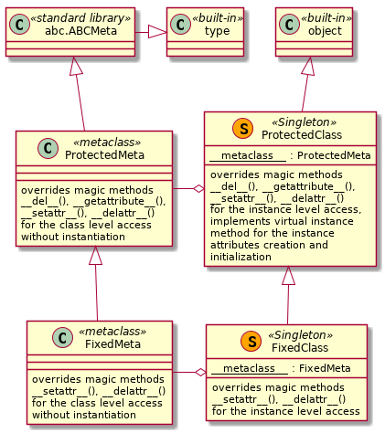

# Design of the libencapsulation Library

## Background

The implementation of the classes in Python is very different from C++ and alike implementations. The most important differences are:

* There are no access modifiers in Python, thus the *encapsulation* in its C++ meaning is not implemented
* Classes in Python are not just data types but the first-class objects themselves, which can be used without instantiation
* The classes are used as templates, 'factories' to create one ot more *instance* objects using the state of the class object at the moment of the instantiation
* The value of any class attribute can be changed at any time, new attributes can be added, existing attributes can be deleted; therefore two instances of the same class created at the different moments in time can be created using different states as the templates
* An instance of a class 'sees' all class attributes, but it can also have a set of its own attributes, reflecting the unique state of that particular instance object; new attributes can be added, existing attributes can be deleted, value of any attribute can be changed
* The Python does not differentiate between the *data fields* and *methods* attributes
* The *data fields* attributes of a class in Python are not *static fields* in the C++ sense; they are just default, 'factory' values for the attributes of the instances of this class, its sub-classes and their instances. Assignment to such an attribute of an instance of this class, or its sub-class, or of an instance of its sub-class creates an attribute with the same name local to the object in question.

All these differences are due to two principal Python design features:

* The class or instance attributes are references to other objects, not the typed variables; which is true for any variable in Python
* The attributes resolution scheme is assymetric concerning read and modification of an attribute:
  * The read access scheme always looks up along the MRO chain starting from the object's local level until it founds the required attribute or reaches the end of the chain, with the second option resulting in an exception
  * The modification access modifies the existing *local* attribute of an object or creates one, if the *local* attribute is not found, unless the *descriptors* mechanism overrules, see [PA001_Descriptors](./Problem_Analysis/PA001_Descriptors/PA001_Descriptors.md)

The diagrams below show the attribute resolution work-flow concerning the read, modification and deletion access without concerns for the *descriptors* mechanism

As its discussed in [PA001_Descriptors](./Problem_Analysis/PA001_Descriptors/PA001_Descriptors.md) and [PA002_Attributes_Resolution](./Problem_Analysis/PA002_Attributes_Resolution/PA002_Attributes_Resolution.md) documents it is required to hook the attributes resolution methods on the class and its metaclass levels in order to implement the modification listed in the [requirements](./requirements.md) document.

## Implementation of 'Protected' and Static Attributes

Following the [PEP 8](https://www.python.org/dev/peps/pep-0008/) the attributes with the names starting with a single underscore ('_') are considered to be 'private' to an object, although it is just an indication, and a programmer can obide with or ignore this indication when working with somebody's class. The attributes with the names starting and ending with double underscores ('__') are *magic* objects, which are used internally by Python, although they are accessible for the programmers. Finally, the names starting with double undescores but not having underscores at the end are given to the attributes invoking the name mangling. Therefore, the following *access modification convention* is proposed:

* Names not starting with an underscore are for the 'public' objects / attributes
* Names starting wuth a subgle underscore are for the 'protected' attributes
* Names starting with two or more underscores are for the *special* attributes, which can be accessed but must be used with caution

Any access to the 'protected' attributes of an object: read, modify or delete - should be prohibited and result in an exception. However, these limitations can be circumvented using *special* attributes / methods, when required.

The implementation of the C++ like static attributes is based on the modification of the attribute modification hook method: the requried *class* attribute is searched along the MRO chain and is modified in the class, where it is defined, whereas the new *local* attribute is created only if the required attribute is not defined anywhere along the MRO chain.

The diagrams below show the required modifications in the attributes resolution scheme without the concerns for the descriptiors support.

Note that in case of the instance attributes access the proposed scheme includes a trigger for the the modified access methods. This trigger is supposed to be envoked only after the instantiation of the class, so the 'protected' instance attributes can be created using the dot notation access during the instantiation.

## Implementation of a Class' Constant Data Structure Scheme

This modification extends the previous one by modification of the set and delete attribute hook methods. It should be implemented in a separate set of sub-classes. The modification includes forbidding the creation and deletion of the class and instance attributes during the life-time of an object, as is shown in the diagrams below.

## Implementation of the Full Support of the Descriptors

The required changes in the attributes resolution scheme as defined in the [PA002_Attributes_Resolution](./Problem_Analysis/PA002_Attributes_Resolution/PA002_Attributes_Resolution.md) document should be combined with those discussed in the [PA001_Descriptors](./Problem_Analysis/PA001_Descriptors/PA001_Descriptors.md) document (see also the diagrams above). Basically speaking, when an existing attribute is found it must be 'HAS A' checked concerning the presence of the descriptor methods *\_get\_*() and *\_set\_*() before falling to the *\_\_getattribute\_\_*() and *\_\_setattr\_\_*() of the **type** or **object** objects.

## Proposed Class Hierarchy

The proposed class diagram is given below.

## Implementation of the Introspective Functionality

The introspection functionality is to be implemented by iterating through the object's dictionaries along the MRO chain and selecting only not already selected 'public' attributes and 'IS A' checking them. To summarize:

* All 'public' attributes registered in the instance's dictionary are the *public instance attributes* - this is the only method, which must be implemented as an instance attribute
* Instance methods are recognized by not being instances of **classmethod** class but being instances of the **types.FunctionType** - can be implemented as an instance or class method, better - as a class method
* Properties are recognized as instances of the **property** class - can be implemented as an instance or class method, better - as a class method
* Class methods are recognized as instances of the **classmethod** class - must be implemented as a class method
* Static methods are recognized as instances of the **staticmethod** class - must be implemented as a class method

## Implementation of the Singleton Behaviour

The proposed solution is to define the metaclasses as sub-classes of the **abc.ABCMeta** class and to define at least one instance method of the classes using these metaclasses as a *abstract* method, i.e. using the **@abc.absractmethod** decorator. The best candidate is a method, where the instance attributes are created.

The idea is that the classes intended to be used as singletons without instantiation do not need to re-define this method, since they are not supposed to have instance attributes. Therefore, such classes cannot be instantiated - such an attempt will result in an exception. The classes instantiated should simply re-define this method without the decorator and to create the instance attributes at the same time, if required.

The common practice is to create the instance attributes inside the *magic* method *\_\_init\_\_*(). In this design another solution is proposed. The *magic* method *\_\_init\_\_*() should be defined such that it will accept any number of the positional and keyword arguments and pass them into a 'protected' instance method, which is responsible for the actual creation and initialization of the instance attributes. Only upon returning from that 'protected' method back to *\_\_init\_\_*() the modication of the attributes resolution scheme should be triggered. Therefore, inside that 'protected' method even the protected attributes can be accessed using dot notation.

The sub-classes are supposed to modify that 'protected' method but not the *magic* method *\_\_init\_\_*(). Basically, the signature of that 'protected' method defines the effective signature of the *\_\_init\_\_*() method.